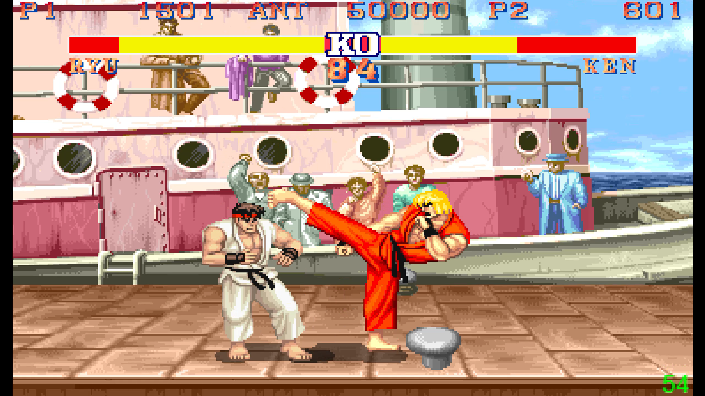
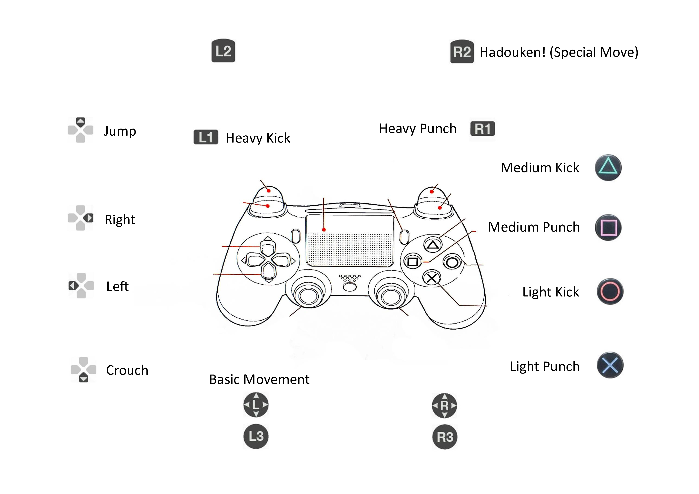

# 🥊 Street Fighter JS: Local Multiplayer Game

## 🛠️ Technical Highlights

- <b>Engine & Rendering:</b> Programmed in vanilla Javascript using HTML Canvas. The core engine utilises a custom game loop to synchronize sprite animations with a Finite State Machine (FSM) for seamless character state transitions
- <b>Hardware Integration:</b> Integrated PS4 controller support, mapped alongside traditional keyboard inputs
- <b>Collision System:</b> Implemented AABB (Axis-Aligned Bounding Box) collision detection to manage hitboxes and hurtboxes, ensuring combat interactions and health bar updates are calculated on each frame.

## 🎮 Controls & Mechanics

Note: To begin, click or press any key on the black screen at the start of the game to initialize the audio and input context.

<b>P1</b> 
Movement: WASD  
Light/Medium/Heavy Punch: G, H, J  
Light/Medium/Heavy Kick: T, Y, U  
Hadouken (Special Move): Spacebar  

<b>P2</b> 
Movement: Arrow keys 
Light/Medium/Heavy Punch: Numkey 1, 2, 3 
Light/Medium/Heavy Kick: Numkey 4, 5, 6 
Hadouken (Special Move): Numkey 7 

